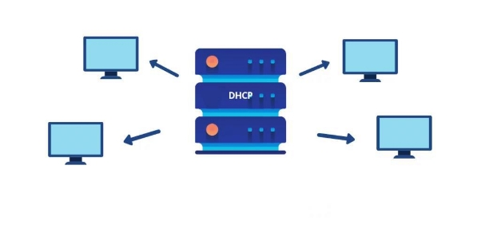
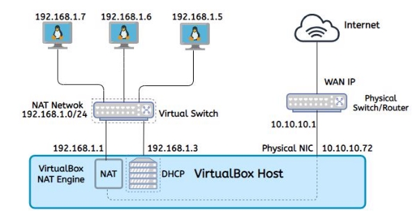

# Dhcp-Server
How to Configure dhcp server in linux

A Step-by-Step Guide To Set Up A DHCP Server 

Team Members: 

EL RHAZOUANI Zineb
ELOBBI Anass
ERROKHSSY Abdelatti
ERRAAD Adil  
KARTIT Hicham
YOUSSI Kenza
SAID EL OUARDI 

Major: **Cyber Security **

**Index:** 

Introduction 

What is a DHCP Server? 

Network configuration: Building internal networks (NAT Net) Set up the DHCP Server: 

- Install the DHCP Server 
- Configure the DHCP Server 
- Bind the DHCP Server to an interface 
- Restart and check the DHCP Server status 
- Verify the configuration 
- Troubleshooting 

What is a Relay Agent? Set up the Relay Agent: 

- Install and the Relay Agent 
- Restart and check the Relay status 
- Verify the configuration 

Conclusion  

**Introduction:**  

The Internet has experienced exponential growth throughout the 1990’s, doubling in size nearly every 10 months. One result is that the Internet Protocol (IP) address space has been allocated at an astounding rate. IP addresses are 32 bits in length, meaning that there are four billion unique addresses and the Internet is not (yet!) anywhere near that size, however the IPs assignment manually will be impossible with that large number of IPs (four billion) that’s why an automated way to distribute and update IP addresses and other configuration information on a network takes place which is the DHCP. 

The key thing to understand about DHCP is that it dynamically assigns IP addresses. This is in contrast with its alternative, static addressing.  With static addressing, IP addresses are assigned manually to specific devices, and do not change over time as the device is used. 

**What is DHCP?** 

Dynamic Host Configuration Protocol (DHCP) is a standardized client/server network protocol that dynamically assigns IP addresses and other related configuration information to network devices. Every device on a TCP/IP- based network must have a unique unicast IP address to access the network and its resources. DHCP also helps conserve the limited IP address space because IP addresses no longer need to be permanently assigned to hosts; only those hosts that are connected to the network consume IP addresses, which significantly reduces the overhead of administration of IP addresses. 

**Network configuration: Building internal networks (NAT Net)** 

To set up a **DHCP server**, we will work on an Ubuntu VM (as DHCP server) and an ArchBang VM (a simple lightweight Linux distro as client) using VirtualBox software. 

By beginning the configuration, we will see that the VMs have a static IP address which is 10.0.2.15(cannot be changed in the GUI), and that because all newer VMs network adapters are by default attached to the **NAT** mode (Network Address Translation), this default net mode provides an access to external networks (LANs), which means that it is sufficient for users who wish to use a VM just for internet access. 

Therefore, if we want to create an internal network, where the DHCP server and the client can communicate with each other, another network mode should be used which is the **NAT Service/Network**. 

This mode is similar to the NAT* mode* functionality, but it provides a network with a DHCP server for assigning IPs dynamically in the purpose of having an internal communication between guests. The example below illustrates how the NAT Service works (example of 3 VMs): 

In order to create a NAT Network, we should use the **VBoxManage**, which is a command line management tool of VirtualBox for configuring all VirtualBox settings, including VirtualBox network settings, then run the following command on the host terminal: 

vboxmanage natnetwork add --netname natnet1 --network "192.168.1.0/24" --enable 

To show all existed DHCP Servers, we use the command below:  

vboxmanage natnetwork list

In the figure below, all **natnet1** information: 

NetworkName:    natnet1 Dhcpd IP:       192.168.1.3 LowerIPAddress: 192.168.1.4 UpperIPAddress: 192.168.1.254 NetworkMask:    255.255.255.0 Enabled:        Yes

Global Configuration:

`    `minLeaseTime:     default

`    `defaultLeaseTime: default

`    `maxLeaseTime:     default

**Set up DHCP Server:**  

Before installation part, the DHCP Server and the client should be connected to **natnet1** by selecting on each VM Network setting section and choosing the natnet1 as shown the figure below: 

**Install the DHCP Server:** 

At the terminal prompt, enter the following command to install DHCP: 

sudo apt install isc-dhcp-server 

**Configure the DHCP Server:**  

To configure DHCP, one recommended way is to back up the original configuration file **/etc/dhcp/dhcpd.conf**. In case if something goes wrong, the original configuration can easily be restored. You can use the **cp** command or **mv** command to create a backup using the **{}** expansion feature of bash. 

sudo mv /etc/dhcp/dhcpd.conf{,.backup}

Now, we need to create a new **dhcp.conf** file and edit the configuration as follows: 

\# minimal sample /etc/dhcp/dhcpd.conf default-lease-time 600; max-lease-time 7200; 

authoritative;

subnet 192.168.1.0 netmask 255.255.255.0 {  range 192.168.1.5 192.168.1.254;

` `option routers 192.168.1.4;

} 

According to this configuration, the DHCP will be able to give an IP address from the range **192.168.1.150-192.168.1.200** with **600** seconds (10min) as a default lease time and **7200** seconds (2h) as a maximum one. 

By using **authoritative**, this DHCP Server will be the official server for the local network. And it will also “advise” the clients to use **192.168.1.4** as getaway address. 

**Bind the DHCP Server to an interface** 

The DHCP Server can have many interfaces, so we need to define which interface should listen on. To show all network interfaces, we use **ip addr.** 

The interface to bind is defined in **/etc/default/isc-dhcp-server**, in our case we simply edit as follows: 

INTERFACESv4="enp0s3" 

**Restart and check the DHCP Server status:** 

After the configuration, we need to restart our server and check its status (if is active or not), using the **systemctl** command: 

sudo systemctl restart isc-dhcp-server.service sudo systemctl status isc-dhcp-server.service 

An active status is shown without any configuration error, indicates that the DHCP Server has successfully picked up the configuration and is ready to hand out IP Addresses. 

**Verify the configuration:** 

In order to verify our configuration, we will add, as we have indicated before, an ArchBang VM as our client, as shown the figure below

The following command shows that ArchBang has received **192.168.1.6** as an IP address, and it’s added to the DHCP lease list. 

dhcp-lease-list --lease /var/lib/dhcp/dhcpd.leases

**Troubleshooting:** 

In the case where the DHCP status looks failed, it’s recommended to visit **/var/log/syslog** file where DHCP diagnostics messages are located. 

sudo gedit /var/log/syslog

**What is a Relay Agent?** 

A **DHCP Relay Agent** is a host or router that forwards DHCP packets between clients and servers. Network administrators can use the DHCP Relay service to relay requests and replies between local DHCP Clients and a remote DHCP Server. It allows local hosts to acquire dynamic IP addresses from the remote DHCP Server.  

**Set up the Relay Agent:** 

Before the installation part, we need to create another **NAT Network** where the DHCP client will be placed with **natnet2** as name and **172.168.1.0/24** as an IP address. 

One important thing is that we should configure two network adapters (or two interfaces) for our Relay Agent VM (Ubuntu VM) the first is attached with **natnet1** and the second with **natnet2**. They will allow the Relay Agent plays as an intermediate bridged that exchanges the series of messages between two network devices as the illustration shows:  

**Install and configurate the Relay:** 

To install the Relay Agent, we can use the following command: 

sudo apt install isc-dhcp-relay 

While the installation process is running a popup window will be shown for indicating the DHCP Server IP and the interface where the Relay will receive the IP requests to forward to the DHCP. 

Now Copy the needed service from **/lib/systemd/system** to **/etc/systemd/system/:** 

sudo cp /lib/systemd/system/isc-dhcp-relay.service /etc/systemd/system/

Another step is to add the configuration of the second network to the **dhcpd.conf** file: 

subnet 172.168.1.0 netmask 255.255.255.0 {  range 172.168.1.5 172.168.1.254; 

` `option routers 172.168.1.4; 

} 

**Restart and check the Relay status:** 

Now that changes to the configuration are made, we need to restart the service to enable those changes. To do that we will use the **systemctl** command: 

sudo systemctl restart isc-dhcp-relay sudo systemctl status isc-dhcp-relay 

The result shows that there is no problem with this configuration: 

**Verify the configuration:** 

After launching the Relay VM, its adapters request an IP from the DHCP and they will be added to its lease list.    

While the Relay and client VMs are presented on different network (192.168.1.0 and 172.167.1.0), the client requests an IP which is forwarded by the Relay to the DHCP. The Relay agent receives DHCP messages and then generates a new DHCP message to send out toward the Archbang client. Finally, they will be added to its lease list as follows: 

The following illustrations (the first from Wireshark and the second is ours) will help you to more understand which type of message exchange between the tree VMs, DHCP Server and DHCP Relay Agent on two Ubuntu VMs and ArchBang Client.

Note that we didn’t configure the Relay interfaces with a static IPs while the DHCP allows the reservation. 

**Conclusion:**

A **DHCP Server** provides IPs address to a **DHCP Clients** through the exchange of a series of messages, known as the DHCP conversation or the DHCP transaction.  If the DHCP Server and DHCP Clients are located on different subnets, a **DHCP Relay Agent** is used to facilitate the conversation. 

